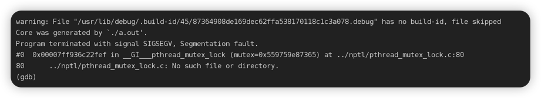

实现简易的WebServer

----lock

-----lock.h  线程同步机制封装类

遇到的问题：

1. Process finished with exit code 139 (interrupted by signal 11: SIGSEGV)  [-23.02.20]

    在实现了监听socket和创建了epoll后，通过浏览器访问时，程序终止，并出现了该错误。
    在相应的提示输出中，可以知道新来的连接可以监听到，并可以把新的连接加入到epoll中了

    之后在终端编译了程序，生成core文件， 使用gdb查看了core文件，错误信息如下所示；之后仔细检查了lock.h和threadpool.h，并没有发现问题。
    

    最终发现这个低级错误，在主函数里没有去初始化线程池，因此也就没有互斥锁，所以才会提示出在加锁的函数中，没有这个东西； 原先的程序应该就是在请求加入到请求队列时终止的。